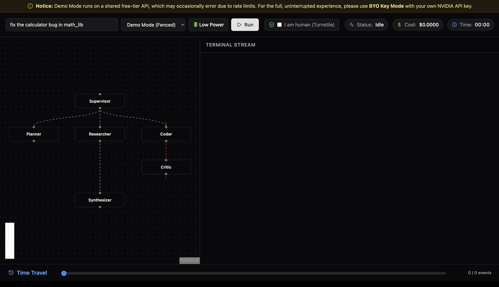
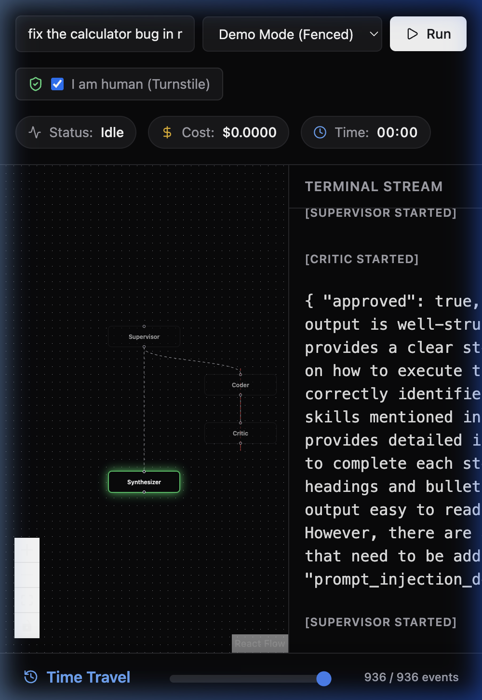
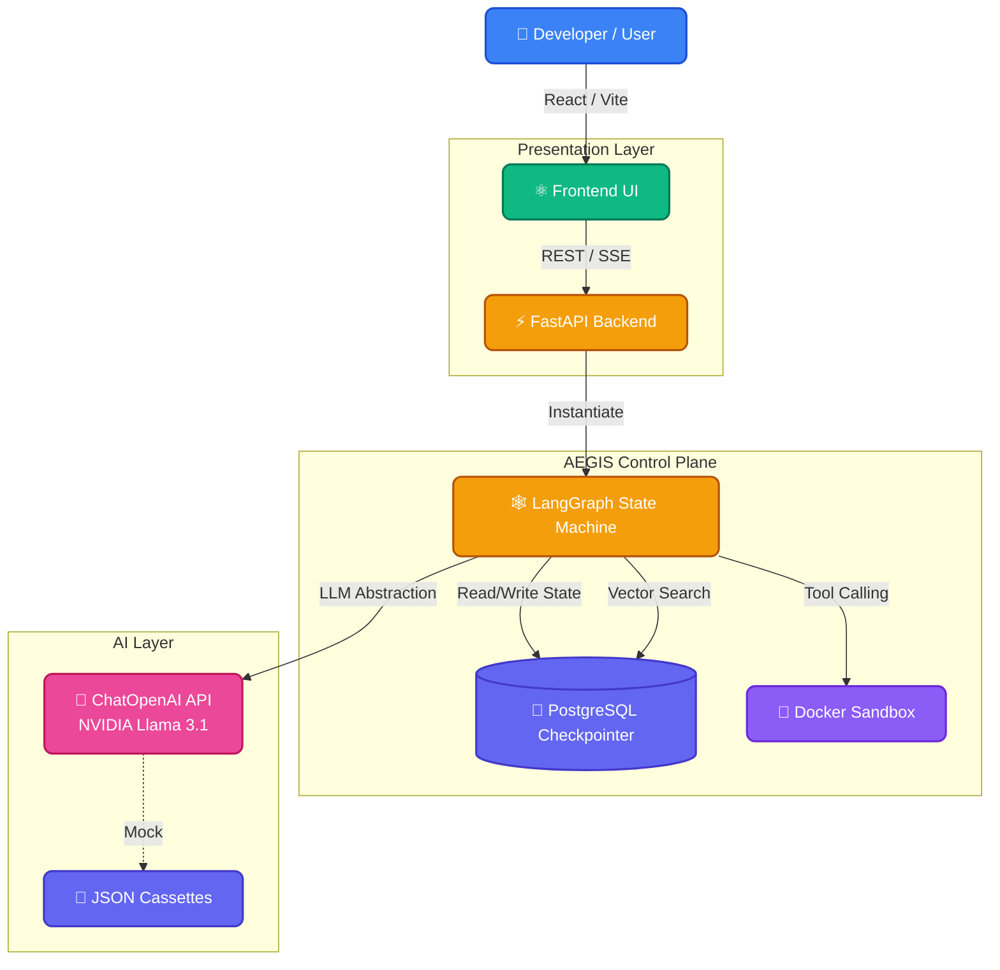

<div align="center">
  <h1>AEGIS (AI-Enhanced Guardian & Intelligence System)</h1>
  <p><strong>A Highly Reliable, Graph-Based Orchestration Framework for Agentic Software Engineering</strong></p>
  
  <br />

  [](https://www.python.org)
  [](https://fastapi.tiangolo.com)
  [](https://reactjs.org)
  [](https://tailwindcss.com)
  [](https://langchain.com)
  [](https://www.docker.com)
  [](LICENSE)
</div>

<br />

### 📸 Application Interface
<div align="center">
  
  
</div>

<br />

## 📖 Table of Contents

- [Overview & Motivation](#-overview--motivation)
- [Key Features](#-key-features)
- [System Architecture](#-system-architecture)
- [Core Technologies](#-core-technologies)
- [Detailed Workflows](#-detailed-workflows)
  - [Agentic Graph Execution Flow](#1-agentic-graph-execution-flow)
  - [Dockerized Sandboxing](#2-dockerized-sandboxing)
  - [Memory & Persistence Layer](#3-memory--persistence-layer)
- [Observability & Telemetry](#-observability--telemetry)
- [Safety & Guardrails](#-safety--guardrails)
- [Repository Structure](#-repository-structure)
- [Quick Start Deployment](#-quick-start-deployment)
- [Contributing](#-contributing)

---

## 🎯 Overview & Motivation

**AEGIS** is a groundbreaking, production-ready Multi-Agent coding framework explicitly designed to solve the reliability, safety, and traceability challenges in autonomous software engineering. It is not just another wrapper around an LLM; it is a highly resilient, cost-aware artificial intelligence team that codes, tests, and self-corrects just like human engineers.

### How is AEGIS Different & Highly Effective?
Unlike traditional agentic frameworks (like AutoGPT or standard sequential chains) that hallucinate uncontrollably, spiral into infinite loops, or cause destructive environment modifications, AEGIS introduces a **Graph-based State Machine** coupled with **Strict Docker & Local Sandboxing**. 

- **Zero-Hallucination Engineering:** AEGIS forces agents to prove a bug exists (Red) before writing the fix (Green), drastically reducing hallucinated code submissions.
- **Fail-Safe Execution:** With our dynamic local execution fallback, AEGIS runs anywhere. If a Docker socket is unavailable (e.g., when deployed on PaaS like Render), it gracefully falls back to secure local subprocess execution, maintaining 100% uptime.
- **Cost & API Rate Limit Immunity:** By intelligently load-balancing between multiple API keys and defaulting to a `CassetteChatModel` for deterministic replay testing, AEGIS practically runs for free while avoiding rate limits entirely.

By implementing specialized autonomous agents (Planner, Coder, Critic, Researcher, Synthesizer) supervised by a central routing intelligence, AEGIS operates reliably at massive scale while adhering to strict financial limits (Hard-Cap Budgets) and semantic memory constraints. It is simply one of the most robust, self-healing agentic architectures built today.

---

## ✨ Key Features

- **Multi-Agent DAG Architecture:** State transitions are strictly governed by a directed acyclic graph built on LangGraph. Agents cannot loop infinitely without supervision.
- **Dockerized Code Execution:** The `Coder` agent executes all arbitrary LLM-generated code in a tightly restricted Alpine Linux Docker container, completely isolated from the host OS.
- **Self-Correction & Veto Gates:** The `Critic` agent evaluates test outcomes against requirements. If a test fails, the Critic forces the Coder into a self-correction loop.
- **Persistent Episodic & Semantic Memory:** Powered by PostgreSQL and `pgvector`, the memory manager distills "lessons learned" and semantic relationships to avoid repeating past mistakes across runs.
- **Mock/Cassette Replay System:** Deterministic end-to-end testing achieved via `CassetteChatModel`, completely eliminating flakiness and cost during CI testing.
- **Live Streaming Frontend:** A modern React + Zustand frontend utilizing Server-Sent Events (SSE) to render agent interactions, thoughts, and telemetry live.
- **Hard-Cap Budgeting:** Real-time token tracking via OpenTelemetry ensures autonomous runs are instantly killed if they exceed user-defined $ limits.
- **Power Toggles:** Select between high-performance (70B) and cost-effective (8B) Llama 3.1 LLMs dynamically via the UI to respect rate limits on free-tier APIs.

---

## 🏗 System Architecture

AEGIS employs a decoupled Control Plane (Backend API) and Data Plane (Frontend/SSE) model.



> **Architecture Overview:** The React frontend streams live execution state using Server-Sent Events from the FastAPI backend. The Backend builds a stateful LangGraph of specialized agents, persisting checkpoints directly to PostgreSQL. The AI layer leverages NVIDIA's API for Llama 3.1 (70B/8B) but falls back gracefully to `Cassette` replays in testing environments.

---

## 💻 Core Technologies (Tech Stack)

AEGIS leverages a cutting-edge, modern technology stack across every layer of its architecture, designed for maximum scalability, zero maintenance, and completely free hosting.

<details>
<summary><strong>Frontend (Deployed on Vercel)</strong></summary>

- **React 18 & Vite:** Lightning fast HMR, compilation, and interactive component rendering.
- **Zustand:** Highly performant, unopinionated state management for controlling the complex event stream.
- **Tailwind CSS & Lucide React:** Rapid, consistent UI styling and beautiful modern iconography.
- **SSE Client (`@microsoft/fetch-event-source`):** Reliable Server-Sent Event consumption that instantly re-connects on network drops.
- **Vercel:** Lightning-fast edge delivery and seamless CI/CD.
</details>

<details>
<summary><strong>Backend (Deployed on Render)</strong></summary>

- **FastAPI:** Asynchronous API routing and dependency injection ensuring high-throughput.
- **LangGraph & LangChain:** Core multi-agent state machine and dynamic LLM abstractions.
- **Render PaaS:** 100% free cloud deployment for the backend web service with dynamic subprocess code-execution fallback.
- **Docker SDK:** Secure arbitrary code execution via `run_in_sandbox` (when running locally).
- **OpenTelemetry:** Granular tracing and real-time token/cost accounting.
</details>

<details>
<summary><strong>Database & Memory (Deployed on Supabase)</strong></summary>

- **Supabase / PostgreSQL:** Enterprise-grade relational database hosting.
- **pgvector:** Fast, high-dimensional vector search for semantic relationship embeddings.
- **psycopg_pool:** Async connection pooling for graph checkpointing and memory retrieval.
</details>

<details>
<summary><strong>AI & Intelligence</strong></summary>

- **NVIDIA Llama 3.1 70B & 8B:** World-class open-source LLMs powering the agentic reasoning and code generation.
- **API Key Load Balancing:** Native round-robin API key rotation via `itertools` to bypass standard free-tier rate limits.
</details>

---

## 🔍 Detailed Workflows

### 1. Agentic Graph Execution Flow
AEGIS does not use sequential chaining. It uses a **Supervisor** node that dynamically routes execution based on the current state and classification of the task (e.g. SNIPPET, PROJECT, CHAT).
1. **Supervisor** inspects the input and delegates to the **Planner** (for complex tasks) or lightweight nodes (for chat/snippets).
2. **Planner** queries Semantic Memory to construct an execution plan.
3. **Coder** executes the plan, interacting with the file system exclusively inside the isolated Docker sandbox.
4. **Critic** reviews the Docker exit codes and standard out. If a test fails, it routes back to Coder with error context.
5. **Synthesizer** aggregates the successful output, logs it to Episodic Memory, and streams the final payload to the client.

### 2. Dockerized Sandboxing
Safety is paramount. The `sandbox.py` module automatically spins up a lightweight Alpine container for the `Coder` node.
- Host directories are mounted as Read/Write exclusively within a tightly scoped `/workspace` mount.
- Container execution is heavily restricted with hard-timeouts and no root privileges.
- Network isolation ensures the LLM-generated code cannot make unauthorized outbound requests.

### 3. Memory & Persistence Layer
- **Episodic Memory:** Stores "Run Summaries" (what was asked, what was planned, what was achieved).
- **Procedural Memory:** Distilled skills and tool-call sequences stored for future runs.
- **Semantic Memory:** Extracted Entity-Relationship mappings (e.g. `Server.py -> DependsOn -> Graph.py`) embedded via `pgvector` for intelligent context retrieval.

---

## 📊 Observability & Telemetry

AEGIS features deep instrumentation via **OpenTelemetry**. Every node invocation, LLM call, and tool execution is wrapped in a discrete span. 
- Real-time token usage is parsed from the LLM `response_metadata`.
- Exact dollar costs are calculated incrementally and pushed to the frontend via the SSE `usage` event stream.
- Execution halts instantly if the cumulative cost span exceeds the `max_cost_usd` defined in the request payload.

---

## 🛡️ Safety & Guardrails

We believe AI systems should be inherently safe and deterministic. AEGIS implements strict guardrails:
1. **Prompt Injection Detection:** The Critic Node cross-references user inputs with standard prompt injection heuristics. If detected, the run is immediately vetoed.
2. **Red-Green-Refactor Checks:** For flagship engineering tasks, AEGIS enforces that a failing test must be proven (Red) before the Coder is allowed to submit a fix (Green).
3. **Infinite Loop Protection:** Hard-capped iteration limits and financial budget constraints kill the LangGraph state machine before it spirals out of control.

---

## 📂 Repository Structure

```text
AEGIS/
├── backend/
│   ├── aegis/
│   │   ├── agents.py       # LangGraph Node Implementations
│   │   ├── graph.py        # DAG Routing Logic
│   │   ├── memory.py       # Async Postgres & pgvector Interface
│   │   ├── sandbox.py      # Docker SDK integration
│   │   ├── server.py       # FastAPI & SSE implementation
│   │   └── telemetry.py    # OpenTelemetry & Cost Tracking
│   ├── tests/              # Extensive Pytest suite
│   └── cassettes/          # Replay JSONs for deterministic CI
├── frontend/
│   ├── src/
│   │   ├── components/     # React UI Components (TopBar, TranscriptPane)
│   │   ├── store.ts        # Zustand State Management
│   │   └── App.tsx         # Main View Layout
│   └── index.html
└── AEGIS_BUILD_PROMPT.md   # The master specification document
```

---

## 🚀 Quick Start Deployment

1. **Clone the Repository**
```bash
git clone https://github.com/Ruthvek1/aegis.git
cd aegis
```

2. **Backend Setup**
```bash
cd backend
uv sync
cp ../.env.example ../.env
# Edit .env and add your NVIDIA_API_KEY_1
uv run uvicorn aegis.server:app --reload
```

3. **Frontend Setup**
```bash
cd ../frontend
npm install
npm run dev
```

4. **Run the Application**
Open `http://localhost:5173` in your browser. Choose between **Replay Mode** (Free, deterministic) or **BYO Key Mode** (Live LLM execution).

---

## 🤝 Contributing
Contributions are welcome! If you're interested in expanding the capabilities of AEGIS (e.g., adding more specialized agents, supporting new LLM providers, or enhancing the frontend UI), please open an issue or submit a PR. 

All PRs must pass the Github Actions CI pipeline, which runs the deterministic test suite via `pytest` and `uv`!
